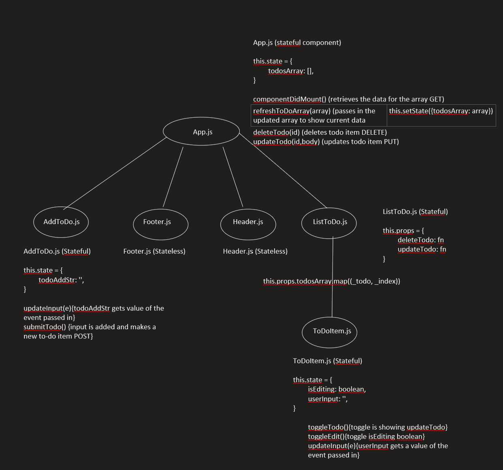

# To-do List App

## Application Concept and Wireframe
### Application Concept
- This is a To-do list creating, deleting, and editing app.
- We will be utilizing an array of objects for list data.
    - GET: get all to-do list items.
    - POST: retrieved items will be posted to our array 
    - PUT: update the to-do list item.
    - DELETE: remove to-do list items that we do not want
### Functionality
- We want a header at the top of the page to display the name of our app
- ToDoList will will pass ToDoItem to App. 
- ToDoItem will toggle between edit and nonEdit mode. 
- ToDoItem will display the text of the To-do Item. 
- ToDoItem will have a button to delete the item. 
- ToDoItem will update when the recipe is completed. 
- AddToDo will have an input box and submit button to add new objects to our array.
- App will show the header and footer. 

### Endpoints 
- GET - fetch our To-do List
- POST - push retrieved items to our array
- PUT - change to-do item text
- DELETE - delete item from the array

### Component  Architecture
- App.js (stateful: hold our retrieved to-do information, this.state.todosArray)
    - Header.js (functional)
    - AddToDo.js (stateful: this.state.todoAddStr)
    - ToDoList.js (stateful: this.props)
        -ToDoItem.js (stateful: this.state.isEditing this.state.userInput)
    - Footer.js (functional)

### Wireframe

